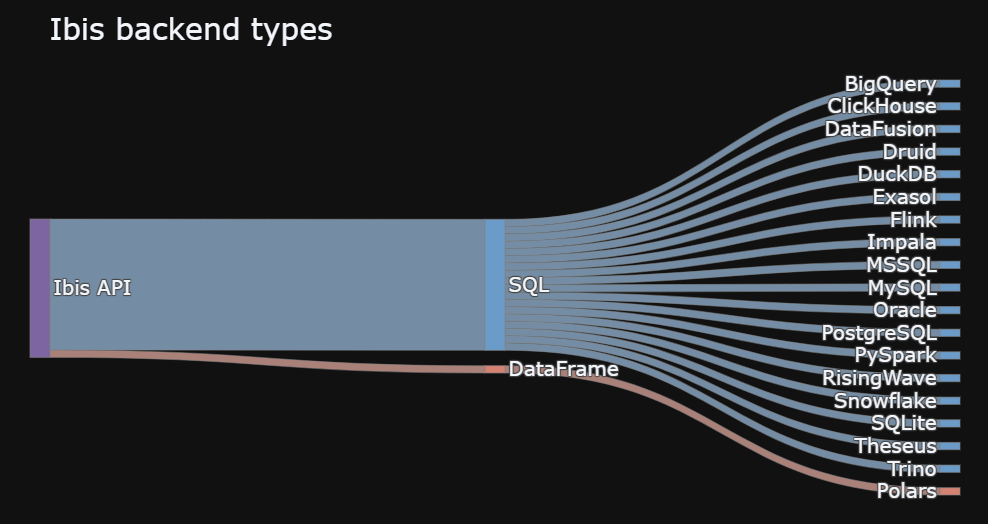

  <h1 align="center">Ibis数据分析框架</h1>
  

    <a href="README.md"><strong>English</strong></a> | <strong>简体中文</strong>
  

## 目录

- [仓库简介](#项目介绍)
- [前置条件](#前置条件)
- [镜像说明](#镜像说明)
- [获取帮助](#获取帮助)
- [如何贡献](#如何贡献)

## 项目介绍
[Ibis](https://github.com/ibis-project/ibis) 是一个开源数据框架库,它可以用同一套数据框操作API，统一操纵各种主流的数据运算框架，使得用户可以更轻松更一致的构建自己的数据分析处理过程。
**核心特性：**
1. 多引擎支持与灵活性：Ibis兼容近20种后端，确保灵活性和广泛适用性,包括主流的关系型数据库、大数据平台及数据仓库。
2. 统一的API实现跨引擎的兼容性：强大的API支持和丰富的后端兼容性，使得Ibis不仅限于本地环境，还能够兼容多种大数据平台，确保了其在各种场景下都能够轻松应对大部分的数据分析任务。
3. Python与SQL的混合编程：Ibis能够将Python的灵活性与SQL的性能优势相结合，在使用Python进行数据操作的同时兼顾SQL的高效查询和计算能力。

**架构设计：**

本项目提供的开源镜像商品 [**Ibis数据分析框架**](https://marketplace.huaweicloud.com)，已预先安装 Ibis 软件及其相关运行环境，并提供部署模板。快来参照使用指南，轻松开启“开箱即用”的高效体验吧。

> **系统要求如下：**
> - CPU: 4GHz 或更高
> - RAM: 8GB 或更大
> - Disk: 至少 60GB

## 前置条件
[注册华为账号并开通华为云](https://support.huaweicloud.com/usermanual-account/account_id_001.html)

## 镜像说明

| 镜像规格                                                                                                                | 特性说明                                         | 备注 |
|---------------------------------------------------------------------------------------------------------------------|----------------------------------------------| --- |
| [ibis10.8.0-kunpeng-v1.0](https://github.com/HuaweiCloudDeveloper/ibis-image/tree/ibis10.8.0-kunpeng-v1.0) | 基于 鲲鹏服务器 + Huawei Cloud EulerOS 2.0 64bit 安装部署 |  |

## 获取帮助
- 更多问题可通过 [issue](https://github.com/HuaweiCloudDeveloper/ibis-image/issues) 或 华为云云商店指定商品的服务支持 与我们取得联系
- 其他开源镜像可看 [open-source-image-repos](https://github.com/HuaweiCloudDeveloper/open-source-image-repos)

## 如何贡献
- Fork 此存储库并提交合并请求
- 基于您的开源镜像信息同步更新 README.md
