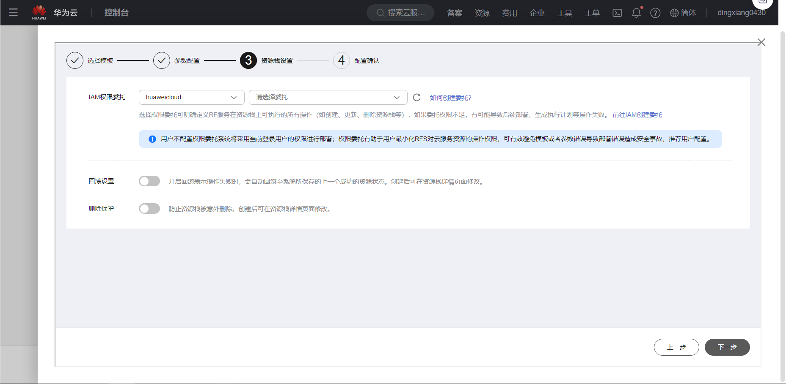

# Ibis使用指南

# 一、商品链接

[Ibis数据分析框架](https://marketplace.huaweicloud.com)

# 二、商品说明
**Ibis** 是一个开源数据框架库,它可以用同一套数据框操作API，统一操纵各种主流的数据运算框架，使得用户可以更轻松更一致的构建自己的数据分析处理过程。  

# 三、商品购买

您可以在云商店搜索 **Ibis数据分析框架**。

其中，地域、规格、推荐配置使用默认，购买方式根据您的需求选择按需/按月/按年，短期使用推荐按需，长期使用推荐按月/按年，确认配置后点击“立即购买”。


## 3.1 使用 RFS 模板直接部署

必填项填写后，点击 下一步


创建直接计划后，点击 确定


点击部署，执行计划

如下图“Apply required resource success. ”即为资源创建完成


##  3.2 ECS 控制台配置

### 准备工作

在使用ECS控制台配置前，需要您提前配置好 **安全组规则**。

> **安全组规则的配置如下：**
> - 入方向规则 放通5432,8000 端口,如指定ip,对应的源地址内必须包含您的客户端ip，否则无法访问 
> - 入方向规则放通 CloudShell 连接实例使用的端口 `22`，以便在控制台登录调试
> - 出方向规则一键放通

### 创建ECS

前提工作准备好后，选择 ECS 控制台配置跳转到[购买ECS](https://support.huaweicloud.com/qs-ecs/ecs_01_0103.html) 页面，ECS 资源的配置如下图所示：

选择CPU架构

选择服务器规格

选择镜像

其他参数根据实际情况进行填写，填写完成之后，点击立即购买即可


> **值得注意的是：**
> - VPC 您可以自行创建
> - 安全组选择 [**准备工作**](#准备工作) 中配置的安全组；
> - 弹性公网IP选择现在购买，推荐选择“按流量计费”，带宽大小可设置为5Mbit/s；
> - 高级配置需要在高级选项支持注入自定义数据，所以登录凭证不能选择“密码”，选择创建后设置；
> - 其余默认或按规则填写即可。

# 四、商品使用

## 修改服务器域名
```shell
vim /etc/hosts
192.168.0.X ecs-0000  修改成本机服务器ip及对应ecs名称
```

## 进入Ibis python3虚拟环境
```shell
source /opt/ibis/bin/activate
```

## 创建与gaussdb数据库的连接
```shell
cd  /opt/ibis
python
```

```python
import ibis
con = ibis.postgres.connect(
  user="username",
  password="password",
  host="hostname",
  port=8000,
  database="database",
  schema="schema_name"
)

查看连接是否有效
con.list_tables()
会列出[schema_name]下的所有表
```

## 进行表相关的操作
```python
t = con.table('table_name')
t
展示 table_name表的元数据信息 例如:
DatabaseTable: table_name
  column1 !int32
  column2 int32
  column3 string(255)
  column4 string(255)
  column5 timestamp(6)
```

* 展示 table_name表聚合后的信息
```python
  a = t.sql("select column,count(*) from table_name group by 1 order by 2 desc").execute()
  a
```

* 创建表
```python
it = con.create_table("ibis_test", schema=ibis.schema(dict(a="int",b='varchar(255)',c='timestamp',d='boolean')))
its = it.sql('select * from ibis_test').execute()
its
```

* 将执行给定表达式的结果写入CSV文件
```python
rst =  t.sql("select * from (select column1,count(*) as cnt from table_name group by 1 order by 2 desc)order by cnt desc").execute()
rst
rst.to_csv("/home/rst")
```

## 参考文档
[Ibis官网](https://ibis-project.org/)
